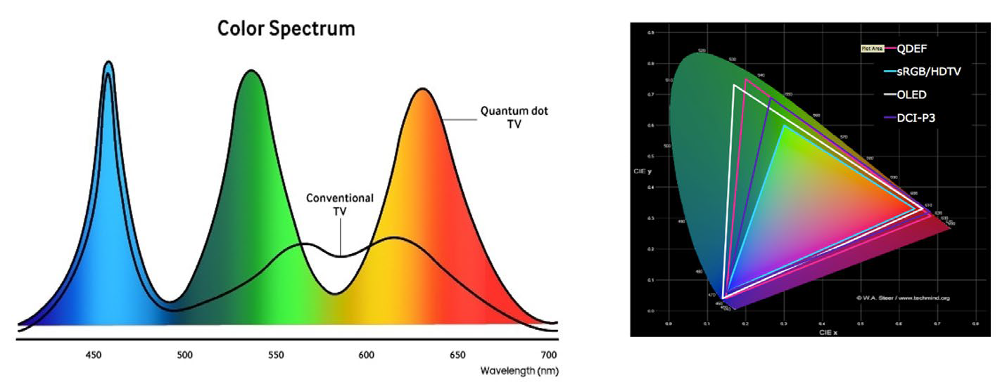

# modern-optics-hw

2022年秋季学期-中山大学电子与信息工程学院-现代光学大作业-光源光谱与色域特性计算

## 问题：

A. 查阅技术资料，得到某种发光器件技术（如OLED、QLED、LED）中RGB三基色的典型光谱，绘制类似于如下左图的光谱功率分布，图必须完全由程序生成，不含导入的位图.

B. 由上述RGB三基色的光谱计算其CIE1931 XYZ色品坐标，并在色品图上绘制类似于如下右图的色域，计算色域大小——以NTSC色域为基准，给出类似于“NTSC 90%“的定量结论（难度系数75%）.

在完成A和B基础上，以下两题选择其一：

C. 查阅CIE2006色彩匹配函数，重新执行色域计算，与上述基于CIE1931的结果同时绘制于色品图上。考虑不同光源技术的不同色域表现，探讨色域对两种色彩匹配函数差异的影响（难度系数95%）.

D. 在上述RGB光源的基础上，加入第四个基色（如黄色），假定第四个基色的光谱宽度、分布等与RGB类似，重新计算此时的色域，分析第四个基色为何种颜色时色域提升最大（难度系数120%）.



左图：光谱功率分布；右图：色品图与色域

## 参考资料

### 程序 (深度！)

* colour -- [colour-science/colour: Colour Science for Python (github.com)](https://github.com/colour-science/colour)
  * 借鉴了colour中的光谱分布图中xyz预处理（E\D65预处理矩阵）*CMCCAT2000* chromatic adaptation transform.  http://en.wikipedia.org/wiki/CIECAM02#CAT02 XYZ -> LMS -> XYZ
    ```
    @incollection{Westland2012k,
      title        = {{{CMCCAT2000}}},
      booktitle    = {Computational {{Colour Science Using MATLAB}}},
      author       = {Westland, Stephen and Ripamonti, Caterina and
        Cheung, Vien},
      year         = 2012,
      edition      = {Second},
      pages        = {83--86},
      isbn         = {978-0-470-66569-5},
    }
    ```
  * 借鉴了colour中的色品图归一化做法，解决了色品图白点偏移的问题，srgb

### 理论

* [CIE1931标准色度系统_QinLanXin的博客-CSDN博客_cie1931标准色度系统](https://blog.csdn.net/QinLanXin/article/details/88884669)
* [色域马蹄图是怎么来的？——CIE 1931 XYZ色彩空间详解 - 知乎 (zhihu.com)](https://zhuanlan.zhihu.com/p/137639368)

### 数据来源：

keyword: `site:cie.co.at STANDARD ILLUMINANT csv`

* [Data Tables | CIE](https://cie.co.at/data-tables)

三刺激值

* RGB [cie.15.2004.pdf (archive.org)](https://ia902802.us.archive.org/23/items/gov.law.cie.15.2004/cie.15.2004.pdf) [色差仪的三原色单位量和三次激值 - 深圳市三恩时科技有限公司 (3nh.com)](http://www.3nh.com/news/739.html)
* CIE 1931 AND 2006 XYZ data [CVRL main](http://www.cvrl.org/) [Colour matching functions (cvrl.org)](http://www.cvrl.org/cmfs.htm) https://cielab.xyz/pdf/CIE2006CMFs.xls

LED

* [Spectral Power Distribution of LED (color.support)](http://color.support/ledspd.html)
* [Downloads | Lighting Lab (psu.edu)](https://sites.psu.edu/llab/downloads/)
* RGB LED data [Opto Semiconductors | OSRAM](https://www.osram.com/apps/downloadcenter/os/?path=%2Fos-files%2FOptical+Simulation%2FLED%2F) -- 本次没使用 [如何在OpticStudio中使用Osram LED光源数据 – 中文帮助 (zemax.com)](https://support.zemax.com/hc/zh-cn/articles/1500005486661) [Understanding the LED spectrum – Photon Grow LED](https://photongrowled.com/blogs/blog/understanding-the-led-spectrum)
* [Spectral Calculator - Illuminating Engineering Society (ies.org)](https://www.ies.org/standards/standards-toolbox/tm-30-spectral-calculator/)

[Statement (auniontech.com)](https://www.auniontech.com/ueditor/file/20171225/1514172625322631.pdf) 三基色图介绍

* [Spectral Calculator - Illuminating Engineering Society (ies.org)](https://www.ies.org/standards/standards-toolbox/tm-30-spectral-calculator/)
* [LED Spectrum Simulator | Waveform Lighting](https://www.waveformlighting.com/led-spectrum-simulator/)

[RGB/XYZ Matrices (brucelindbloom.com)](http://www.brucelindbloom.com/index.html?Eqn_RGB_XYZ_Matrix.html) And Colour
